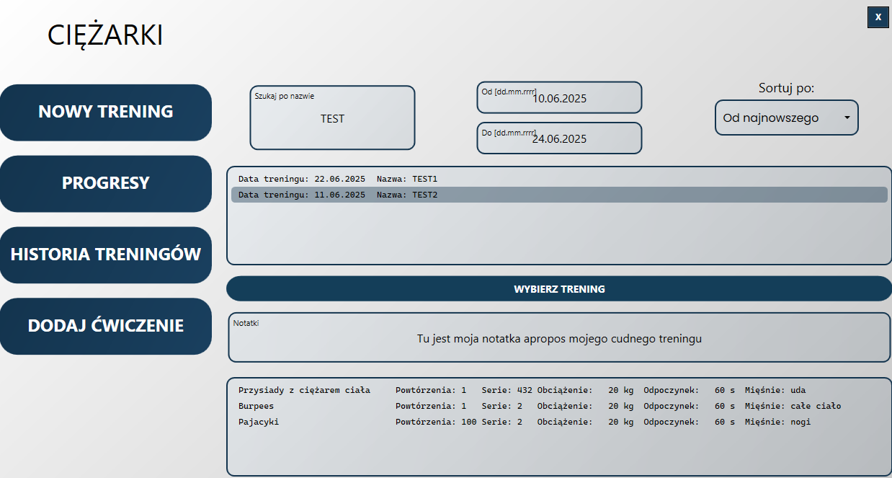
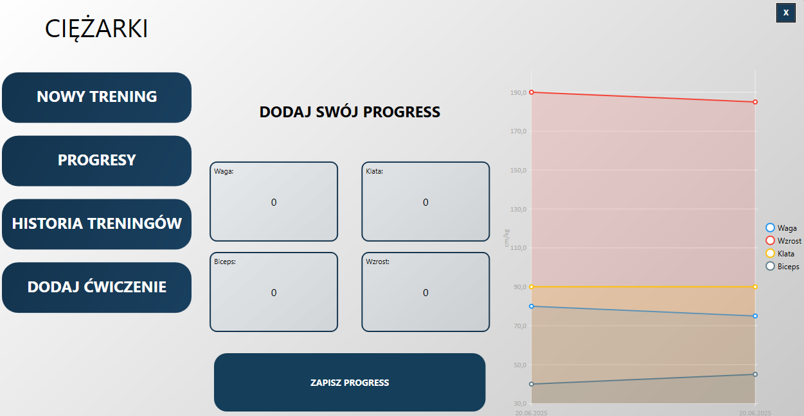

# 🏋️‍♂️ Ciężarki - Twój Osobisty Asystent Treningowy

Aplikacja desktopowa typu *Workout Tracker* stworzona w technologii WPF. Służy do planowania treningów, bazy ćwiczeń oraz śledzenia postępów siłowych i sylwetkowych. Projekt zrealizowany w ramach przedmiotu **Programowanie obiektowe i graficzne**.

## 📸 Rzut oka na aplikację
Widok z historią treningów z możliwością filtracji

Widok z wykresem zmian wymiarów ciała

## 🚀 Funkcjonalności

Aplikacja umożliwia kompleksowe zarządzanie aktywnością na siłowni:

* **🗂 Baza Ćwiczeń:** Dodawanie i edycja własnych ćwiczeń.
* **📅 Planowanie Treningów:** Tworzenie planów treningowych i przypisywanie do nich ćwiczeń.
* **📈 Śledzenie Progresu:** Rejestrowanie historii treningów oraz pomiarów ciała (waga, obwód klatki piersiowej, bicepsa itp.).
* **👤 Profile Użytkowników:** Obsługa wielu użytkowników na jednym urządzeniu.

## 🛠️ Stack Technologiczny

Projekt został zbudowany zgodnie z nowoczesnymi standardami programowania desktopowego w środowisku .NET:

* **Język:** C#
* **Framework UI:** WPF (Windows Presentation Foundation)
* **Wzorzec projektowy:** **MVVM** (Model-View-ViewModel)
* **Baza danych:** SQLite + Entity Framework Core.

## 💾 Baza Danych i Architektura

Aplikacja korzysta z lokalnej bazy danych **SQLite** (`app.db`), co zapewnia prywatność danych i brak konieczności konfiguracji serwera.

### Struktura relacji:
* Użytkownik (`User`) ↔ Wiele treningów (`UserWorkout`)
* Trening (`Workout`) ↔ Wiele ćwiczeń (`WorkoutExercises`)
* Logi postępu (`ProgressLog`) powiązane z użytkownikiem.

## 🔮 Plany rozwoju (Roadmap)

Projekt jest otwarty na rozbudowę. W przyszłości planujemy:
* [ ] Integrację z zewnętrzną bazą danych (synchronizacja w chmurze).
* [ ] Moduł społecznościowy (dzielenie się planami treningowymi).
* [ ] Dodanie multimediów (zdjęcia/wideo instruktażowe do ćwiczeń).
* [ ] Kalkulator spalonych kalorii.
